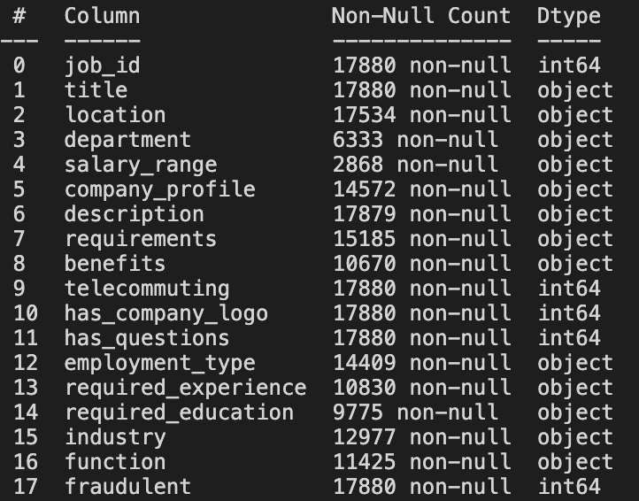
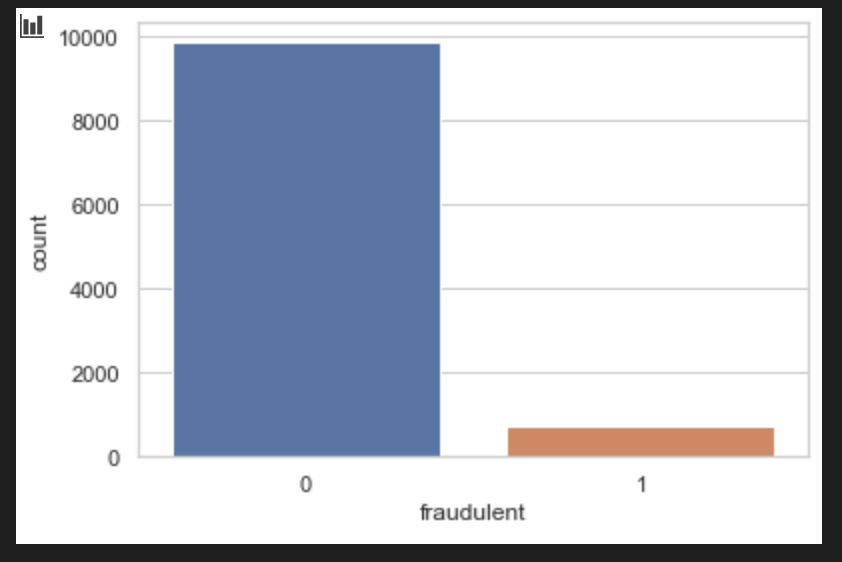
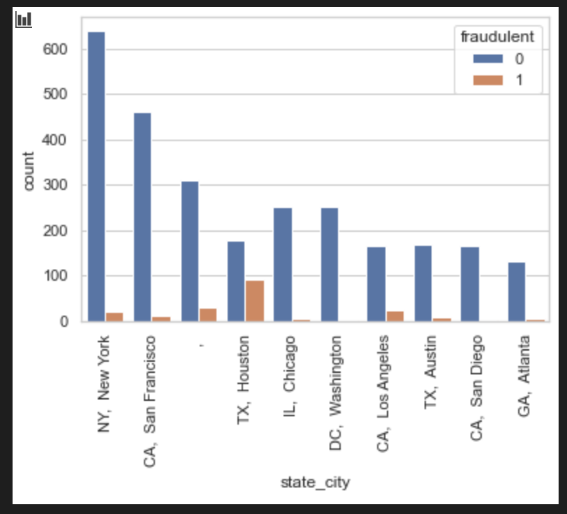
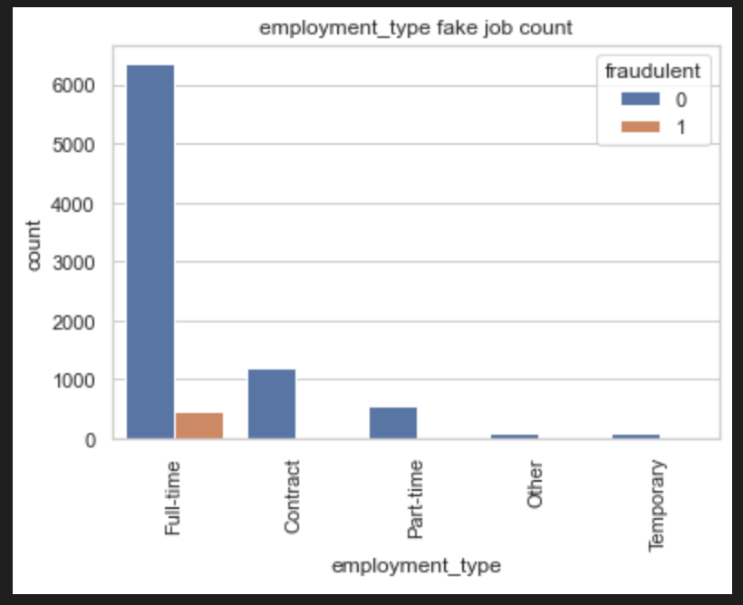
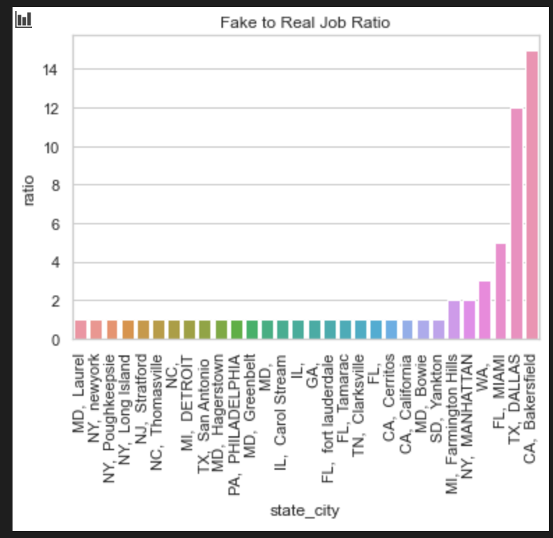
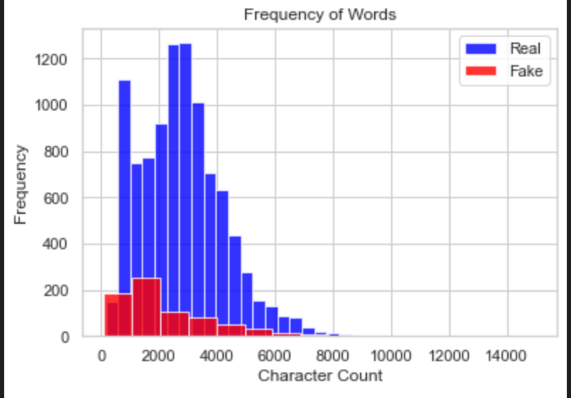

# Fake-Job-Posting-Prediction

## Project Overview

Employment scams are on the rise. According to CNBC, the number of employment scams doubled in 2018 as compared to 2017. The current market situation has led to high unemployment. Economic stress and the impact of the coronavirus have significantly reduced job availability and the loss of jobs for many individuals. A case like this presents an appropriate opportunity for scammers. Many people are falling prey to these scammers using the desperation that is caused by an unprecedented incident. Most scammer do this to get personal information from the person they are scamming. Personal information can contain address, bank account details, social security number etc.
I am an university student, and I have received several such scam emails. The scammers provide users with a very lucrative job opportunity and later ask for money in return. Or they require investment from the job seeker with the promise of a job. This is a dangerous problem that can be addressed through Machine Learning
techniques and Natural Language Processing (NLP).

## Problem Statement

This project uses data from [Kaggle](https://www.kaggle.com/shivamb/real-or-fake-fake-jobposting-prediction) to determine if a job posting is real or fake.

## Metrics Used

The follwing metrics have been used to evaluate the project:

[1] Accuracy

[2] F1-score

## Analysis

### Data Exploration

I started the data exploration with the entire dataset that consisted of 17880 observations and 18 features. These are features are - 

I decided to use only data from US based locations that account for nearly 60% of the dataset. I did so to ensure that I have data in english. Also, the location is split into state and city for further analysis. The final dataset has 10593 observations and 20 features. 

After determining the final dataset I moved on to expoloring the dataset further based on other features. 

1. **Real vs fake job distribution**:

It is visible from the plot that the fake jobs are a very small fraction of the real ones.

2. **Location based real vs fake job distribution:**

From the plot it can be seen that Houston, TX has the very high fake to real job ratio. 

3. Employment_type based real vs fake job distribution:

Most fraudulent offers arise in a situation when the type to job offered is full time.

Other analysis:

- Most entry level jobs have fraudulent jobs
- Jobs requiring only a bachelor's degree or high school education have a higher chance of being fraudulent. 

To enhance the results of this analysis, I created a fraud to real ratio for different locations. Based on the ratio a countplot is designed to view places with very high ratios. 

Some places like Bakersfield, CA and Dallas, Texas have a very high fake to realy job ratio. Location seems to be a very importanr factor in evaluating fake jobs. 
Two other features - telecommuting and has_company_logo had some kind of relationship with fake jobs as well. 58.6% of fradualent jobs have both these feature values equal to 0.

After performing EDA and determing important features a new dataframe is created. This dataset has the following feilds- 

1. telecommuting
2. has_company_logo	
3. has_questions	
4. fraudulent	
5. ratio: fake to real job ratio based on location
6. text: combination of title, location, company_profile, description, requirements, benefits, required_experience, required_education, industry and function
7. Word count: Count of words in the textual data

This final dataset is used further for text preprocessing before using a final model.

### Data Preprocessing

Using python's natural language processing package - nltk the next steps are peformed. The text data is tokenized, stopwords are removed and the text is lemmatized. A new clean dataset is used for the final step of this project - modeling.

## Modeling

### Methodology

The new and clean dataset is used for creating the final models. The. X and y variables are separated. 

X: telecommuting, has_company_logo, has_questions, ratio, text, character_count

y: fraudulent

This dataset is split into test-train datasets using sci-kit learn's train_test_split method. The test set is one-third of the entire dataset. Using CountVectorizer from sci-kit learn the text data from X is converted to a count matrix which will be used in the **baseline** model - Naive Bayes. The accuarcy of this calssifier is 0.971. 

Another model - SGDClassifier is used and it produces an accuracy of 0.974. Based on accuracy scores, SGDClassifier is chosen. Another SDGClassifier is implemented on the numeric part of the dataset. The accuarcy of the test counterpart of this is 0.934. The final results of both these models are combined and a final output is generated. Both models needs to say that a particular job is real inorder to give the final output as real. If either or both say that the job is fraudulent, the job is put in the fraudulent category. 

The f1 score for this model is 0.79. 

## Conclusion

This model is quite effective in determing if a job is real. However, due to a small fraction of data belonging to the fradulent class, the ML aglorith is in general favorable to rhe dominant class. Further work requires using techniques like SMOTE to create a class balance.

